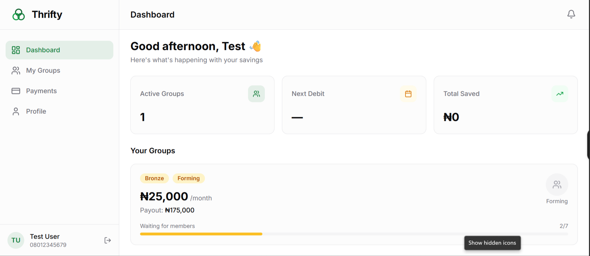
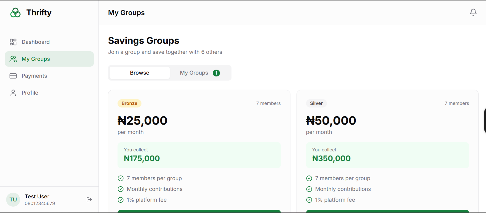
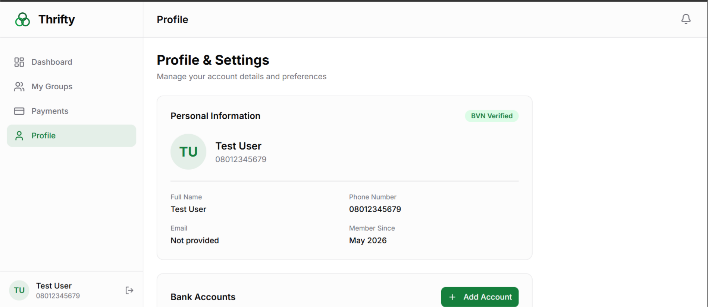
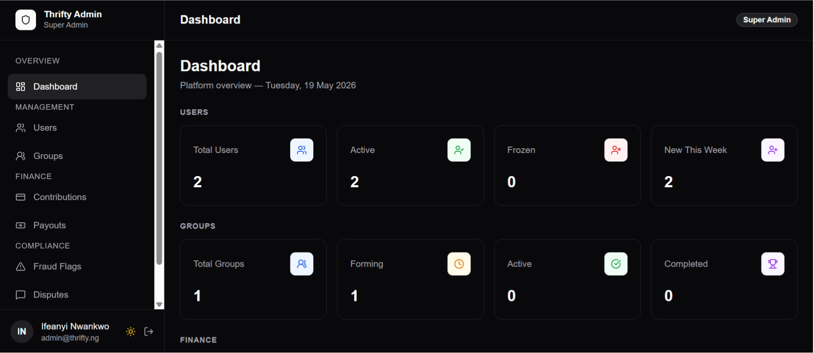
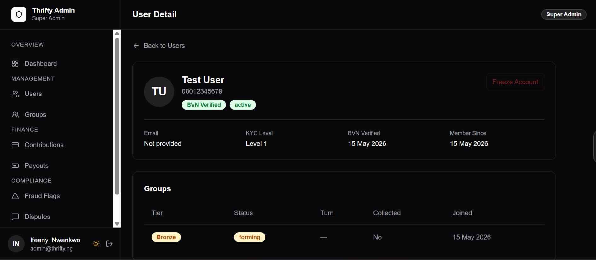

# Thrifty

> A digital cooperative savings platform for Nigeria — bringing ajo and esusu into the modern fintech era.

Thrifty digitises the traditional Nigerian rotating savings system (ajo/esusu) where groups of people contribute a fixed amount monthly and one member collects the full pot each cycle. The platform handles group formation, BVN-based KYC, automated monthly debits via Paystack direct debit, turn-based payouts, and a full admin console for operations and compliance.

---

## Live URLs

| App           | URL                                                                        |
| ------------- | -------------------------------------------------------------------------- |
| User web app  | [thrifty-alpha.vercel.app](https://thrifty-alpha.vercel.app)               |
| Admin console | [thrifty-admin.vercel.app](https://thrifty-admin.vercel.app)               |
| API server    | [thrifty-api-server.onrender.com](https://thrifty-api-server.onrender.com) |

---

## Screenshots

### User App (thrifty-web)

<table>
  <tr>
    <td></td>
    <td></td>
  </tr>
  <tr>
    <td></td>
    <td></td>
  </tr>
</table>

### Admin Console (thrifty-admin)

<table>
  <tr>
    <td></td>
    <td></td>
  </tr>
</table>

---

## System Architecture



The architecture is split into six layers:

- **Client layer** — Vue 3 SPA (user app + admin console) served from Vercel's global CDN; fully mobile responsive
- **API gateway** — Express with JWT auth, rate limiting, role-based access control, and audit logging middleware
- **Core services** — Auth, User, Group, Cycle, Debit, Payout, Fraud, and Notification service modules
- **External integrations** — Paystack (direct debit + transfers), Dojah/Smile ID (BVN KYC verification), SMS provider
- **Data layer** — Neon PostgreSQL (primary store), Upstash Redis (BullMQ queues + caching)
- **Background jobs** — BullMQ workers for debit scheduling, payout processing, retry logic, and notifications

**Security implemented:** BVN hashed with Argon2id, bank account numbers stored as Paystack vault tokens (never raw), TLS in transit, JWT RS256 auth, rate limiting per IP.

---

## Tech Stack

### Frontend (thrifty-web & thrifty-admin)

| Technology      | Purpose                      |
| --------------- | ---------------------------- |
| Vue 3 + Vite    | SPA framework and build tool |
| Tailwind CSS v3 | Utility-first styling        |
| shadcn-vue      | Accessible component library |
| Pinia           | State management             |
| Vue Router      | Client-side routing          |
| Axios           | HTTP client                  |
| lucide-vue-next | Icon library                 |

### Backend (thrifty-api)

| Technology             | Purpose                                    |
| ---------------------- | ------------------------------------------ |
| Node.js 20+ (ESM)      | Runtime                                    |
| Express 4              | REST API framework                         |
| PostgreSQL 15 + Knex   | Relational database + query builder        |
| Upstash Redis + BullMQ | Job queues and caching                     |
| Paystack               | Direct debit mandates and payouts          |
| Dojah / Smile ID       | BVN verification and KYC                   |
| Argon2id               | Password hashing                           |
| JWT (RS256)            | Authentication tokens                      |
| Zod                    | Environment variable and schema validation |

### Infrastructure

| Service | Role                                           |
| ------- | ---------------------------------------------- |
| Vercel  | Frontend hosting (thrifty-web + thrifty-admin) |
| Render  | API server hosting                             |
| Neon    | Managed PostgreSQL                             |
| Upstash | Managed Redis                                  |
| GitHub  | Source control                                 |

---

## Monorepo Structure

```
thrifty/
├── thrifty-api/              # Node.js/Express backend
│   └── src/
│       ├── config/           # DB, Redis, queue, env config
│       ├── services/         # Business logic (auth, group, debit, payout...)
│       ├── routes/           # Express routers
│       ├── jobs/             # BullMQ job processors
│       ├── middleware/       # Auth, validation, rate limiter, audit log
│       └── db/
│           ├── migrations/   # Knex migration files
│           ├── seeds/        # Dev seed data
│           └── queries/      # Raw SQL helpers per domain
│
├── thrifty-web/              # Vue 3 user-facing app
│   └── src/
│       ├── views/            # Dashboard, Groups, Payments, Profile
│       ├── components/       # Reusable UI components
│       ├── stores/           # Pinia stores (auth, groups, payments)
│       ├── composables/      # useApi, useCurrency, useAuth
│       └── services/         # Axios API service layer
│
└── thrifty-admin/            # Vue 3 admin console
    └── src/
        ├── views/            # Dashboard, Users, Groups, Contributions,
        │                     # Payouts, Fraud, Disputes, Audit
        ├── layouts/          # AppLayout with dark mode toggle
        ├── composables/      # useTheme
        └── services/         # adminApi axios instance
```

---

## Features

### User App

- **Registration & KYC** — phone number registration, BVN verification via Dojah/Smile ID, KYC level gating
- **Savings Groups** — browse tiers (Bronze, Silver, Gold, Platinum), join groups, track turn position
- **Dashboard** — active groups overview, next debit date, total saved
- **Payments** — view contribution history, payout status
- **Profile** — personal information, linked bank accounts, BVN verification status
- **Dark/Light mode** — persisted theme preference

### Admin Console

- **Dashboard** — real-time platform stats: total users, active/frozen accounts, group formation status, finance overview
- **User management** — list all users, view full user detail (KYC level, BVN status, group memberships), freeze/unfreeze accounts
- **Group management** — view all groups by tier and status, group membership details
- **Contributions** — full contribution ledger across all groups
- **Payouts** — payout history and status tracking
- **Fraud flags** — review and resolve flagged accounts
- **Disputes** — manage user-raised disputes
- **Audit logs** — complete trail of all admin actions
- **Role-based access** — Super Admin, Operations, Finance, Compliance, Support roles
- **Dark mode** — toggle with persistence via localStorage

---

## Savings Tiers

| Tier     | Monthly Contribution | Total Payout | Platform Fee | Min KYC |
| -------- | -------------------- | ------------ | ------------ | ------- |
| Bronze   | ₦25,000              | ₦175,000     | 1%           | Level 1 |
| Silver   | ₦50,000              | ₦350,000     | 1%           | Level 1 |
| Gold     | ₦100,000             | ₦700,000     | 0.75%        | Level 2 |
| Platinum | ₦250,000             | ₦1,750,000   | 0.5%         | Level 2 |

Each group has 7 members. Members contribute monthly and receive the full pool on their assigned turn.

---

## API Overview

Full interactive API documentation is available via Swagger UI:

**[thrifty-api-server.onrender.com/api/docs](https://thrifty-api-server.onrender.com/api/docs)**

The raw OpenAPI JSON spec is also available at `/api/docs.json` for importing into Postman or Insomnia.

### Auth
| Method | Endpoint             | Description                |
| ------ | -------------------- | -------------------------- |
| POST   | `/api/auth/register` | Register with phone number |
| POST   | `/api/auth/login`    | Login, returns JWT         |
| POST   | `/api/auth/refresh`  | Refresh access token       |
| POST   | `/api/auth/logout`   | Invalidate token           |

### Users
| Method | Endpoint                      | Description                 |
| ------ | ----------------------------- | --------------------------- |
| GET    | `/api/users/me`               | Get current user profile    |
| PATCH  | `/api/users/me`               | Update profile              |
| POST   | `/api/users/me/bank-accounts` | Add bank account            |
| POST   | `/api/users/me/kyc/bvn`       | Submit BVN for verification |

### Groups
| Method | Endpoint               | Description           |
| ------ | ---------------------- | --------------------- |
| GET    | `/api/groups`          | List available groups |
| POST   | `/api/groups/:id/join` | Join a group          |
| GET    | `/api/groups/me`       | Get user's groups     |

### Webhooks
| Method | Endpoint                 | Description                                            |
| ------ | ------------------------ | ------------------------------------------------------ |
| POST   | `/api/webhooks/paystack` | Paystack event handler (debit success/failure, payout) |

### Admin
| Method | Endpoint                        | Description           |
| ------ | ------------------------------- | --------------------- |
| POST   | `/api/admin/auth/login`         | Admin login           |
| GET    | `/api/admin/dashboard`          | Platform stats        |
| GET    | `/api/admin/users`              | List all users        |
| GET    | `/api/admin/users/:id`          | User detail           |
| POST   | `/api/admin/users/:id/freeze`   | Freeze user account   |
| POST   | `/api/admin/users/:id/unfreeze` | Unfreeze user account |
| GET    | `/api/admin/groups`             | List all groups       |
| GET    | `/api/admin/contributions`      | Contribution ledger   |
| GET    | `/api/admin/payouts`            | Payout history        |
| GET    | `/api/admin/fraud`              | Fraud flags           |
| GET    | `/api/admin/disputes`           | Disputes              |
| GET    | `/api/admin/audit`              | Audit logs            |

---

## Environment Variables

### thrifty-api

```env
NODE_ENV=production
PORT=3000

# Database
DATABASE_URL=postgresql://...

# Redis
REDIS_URL=redis://...

# JWT
JWT_SECRET=...
JWT_REFRESH_SECRET=...

# Paystack
PAYSTACK_SECRET_KEY=sk_live_...
PAYSTACK_PUBLIC_KEY=pk_live_...

# KYC
DOJAH_APP_ID=...
DOJAH_SECRET_KEY=...

# CORS
ALLOWED_ORIGINS=https://thrifty-alpha.vercel.app,https://thrifty-admin.vercel.app
```

### thrifty-web

```env
VITE_API_URL=https://thrifty-api-server.onrender.com
```

### thrifty-admin

```env
VITE_API_URL=https://thrifty-api-server.onrender.com
```

---

## Local Development

### Prerequisites

- Node.js 20+
- PostgreSQL (or a Neon connection string)
- Redis (or an Upstash connection string)

### Setup

```bash
# Clone the repo
git clone https://github.com/Kingsley-coder-prog/thrifty.git
cd thrifty

# Install dependencies for all three apps
cd thrifty-api && npm install && cd ..
cd thrifty-web && npm install && cd ..
cd thrifty-admin && npm install && cd ..
```

### Run the API

```bash
cd thrifty-api

# Copy env and fill in your values
cp .env.example .env

# Run database migrations
npm run migrate

# Seed tiers
npm run seed

# Start the API server
npm run dev

# Start the BullMQ worker (separate terminal)
npm run worker
```

### Run the web app

```bash
cd thrifty-web
npm run dev
# → http://localhost:5173
```

### Run the admin console

```bash
cd thrifty-admin
npm run dev
# → http://localhost:5174
```

---

## Deployment

### API — Render

The API is deployed as a **Web Service** on Render. The BullMQ worker runs as a separate **Background Worker** service on the same repo.

- Build command: `npm install`
- Start command: `node src/index.js`
- Worker start command: `node src/worker.js`
- All environment variables set via Render dashboard

### Frontend — Vercel

Both `thrifty-web` and `thrifty-admin` are deployed separately on Vercel from the same monorepo.

For each project on Vercel:
- **Root directory**: `thrifty-web` or `thrifty-admin`
- **Framework preset**: Vite
- **Build command**: `npm run build`
- **Output directory**: `dist`
- `vercel.json` in each app handles SPA routing rewrites

---

## Known Gaps / Future Work

- **2FA** — architecture specifies mandatory 2FA on login and financial actions; not yet implemented. Planned via TOTP or SMS OTP.
- **Immutable financial audit log** — admin action audit is implemented; auto-logging of every debit, payout, and group state change into a permanent immutable ledger is planned.
- **Native mobile app** — the web app is fully mobile responsive and works on all screen sizes. A dedicated native mobile app (React Native or Flutter) is a future milestone outlined in the architecture.

---

## Author

**Ifeanyi Nwankwo**
GitHub: [@Kingsley-coder-prog](https://github.com/Kingsley-coder-prog)